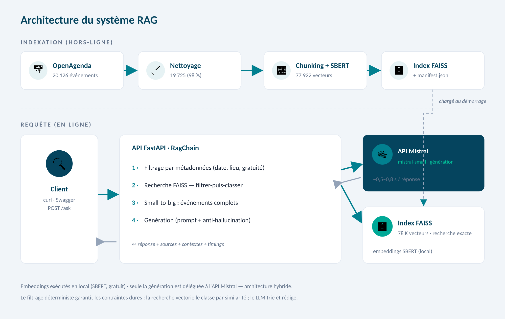

# Rapport technique — Assistant intelligent de recommandation d'événements culturels

**Projet :** POC d'un système RAG pour Puls-Events
**Périmètre :** événements culturels d'Île-de-France (données OpenAgenda)
**Auteur :** Saïd MoURAD
**Date :** 15 juin 2026
**Dépôt :** https://github.com/saidmo/p07_concevez_et_deployez_un_systeme_RAG

---

## 1. Objectifs du projet

### Contexte

Puls-Events développe une plateforme de recommandations culturelles personnalisées
et souhaite tester un chatbot capable de répondre, en langage naturel, à des
questions d'utilisateurs sur les événements culturels à venir. La mission confiée
consiste à livrer un POC (Proof of Concept) complet d'un système RAG
(Retrieval-Augmented Generation), exploitable via une API par les équipes produit
et marketing.

### Problématique : pourquoi un système RAG ?

Les données d'événements (titres, descriptions, dates, lieux, tarifs) évoluent en
permanence et sont trop volumineuses pour être intégrées dans le contexte d'un
modèle de langage. Un LLM seul, interrogé sur « un concert de jazz à Paris début
juillet », répondrait à partir de ses connaissances figées : il inventerait des
événements (hallucination) ou avouerait son ignorance.

Le RAG répond précisément à ce besoin : il **récupère** d'abord, par recherche
sémantique, les événements réels pertinents dans une base à jour, puis **génère**
une réponse en langage naturel fondée uniquement sur ces événements. La réponse
est ainsi actuelle, vérifiable et traçable jusqu'à la source.

### Objectif du POC

Démontrer trois choses :

- **la faisabilité technique** : un pipeline complet collecte → nettoyage →
  vectorisation → chaîne RAG → API, conteneurisé et reproductible ;
- **la valeur métier** : des réponses pertinentes à des questions réalistes,
  chaque recommandation étant rattachée à sa fiche événement ;
- **la performance** : une qualité de réponse mesurée objectivement sur un jeu de
  test annoté, avec des métriques automatisées.

### Périmètre

| Dimension | Choix |
|---|---|
| Zone géographique | Île-de-France (8 départements) |
| Période | ~1 an d'historique + ~1 an à venir (collecte du 30 mai 2026) |
| Source | OpenAgenda, via le hub OpenDataSoft (Huwise) |
| Volume | 20 126 événements bruts → 19 725 après nettoyage |

---

## 2. Architecture du système

### Schéma global

Le flux, de la donnée brute à la réponse utilisateur, se déroule en deux temps :
une phase d'**indexation hors-ligne** (collecte → nettoyage → vectorisation →
index FAISS, exécutée une fois et à la demande via `/rebuild`) et une phase de
**requête en ligne** (la chaîne RAG, sollicitée à chaque question).



*Indexation hors-ligne : les événements OpenAgenda sont collectés, nettoyés,
découpés et vectorisés (SBERT) dans un index FAISS. Requête en ligne : l'API
FastAPI orchestre le filtrage par métadonnées, la recherche vectorielle
(filtrer-puis-classer), la reconstitution des événements complets (small-to-big)
et la génération via l'API Mistral. Les embeddings sont calculés en local ; seule
la génération est déléguée à un service distant — architecture hybride.*

### Technologies utilisées

| Couche | Technologie | Version |
|---|---|---|
| Langage | Python | 3.11 (Docker) / 3.13 (dev local) |
| Embeddings | SentenceTransformers (SBERT) | 3.4.1 |
| Modèle d'embedding | paraphrase-multilingual-mpnet-base-v2 | — |
| Base vectorielle | FAISS (CPU) | 1.9.0.post1 |
| Orchestration RAG | LangChain | 0.3.x |
| LLM (génération) | API Mistral (mistral-small-latest) | via langchain-mistralai 0.2.10 |
| API REST | FastAPI + Uvicorn | 0.115 / 0.34 |
| Validation | Pydantic | 2.11 |
| Conteneurisation | Docker / Docker Compose | — |
| Tests | pytest | 8.3 |
| Évaluation | Ragas + métriques maison | 0.2.15 |

---

## 3. Préparation et vectorisation des données

### Source de données

Les événements proviennent de l'API Explore v2.1 d'OpenDataSoft (hub Huwise),
jeu de données `evenements-publics-openagenda`. Le script `collect_data.py`
exporte les événements filtrés par **région** (`location_region = "Île-de-France"`)
et par **période** (paramètres `--days-history` / `--days-future`, 365 jours
chacun par défaut), via une requête d'export JSON paginée. Résultat : un fichier
brut de ~90 Mo contenant 20 126 événements.

### Nettoyage

Le script `clean_data.py` produit un jeu propre et structuré. **19 725 événements
conservés (98,0 %)**. Anomalies traitées :

| Anomalie | Traitement |
|---|---|
| Balises HTML dans les descriptions | Suppression (BeautifulSoup), normalisation des espaces |
| Champs sérialisés en chaîne JSON (`status`, `attendancemode`, `timings`) | Désérialisation puis extraction du label français |
| Événements annulés (59) | Exclusion (statut + titre) |
| Événements vides de contenu (342) | Exclusion |
| `age_max` aberrants (56 valeurs ≥ 110, jusqu'à 121) | Plafonnés / mis à None |
| Tarifs hétérogènes | Normalisés en `Gratuit` / `<montant>` / `Sur inscription` |
| Villes manquantes (21) | 10 récupérées depuis l'adresse |
| Doublons | 0 détecté |

La validité du nettoyage est couverte par 33 tests unitaires (`test_clean_data.py`).

### Chunking

La description médiane d'un événement fait 859 caractères ; **84 % des événements
dépassent donc une seule unité** et doivent être découpés. Le découpage utilise
`RecursiveCharacterTextSplitter` (LangChain) avec une **taille de 450 caractères
et un chevauchement de 80**.

Justification de la taille : le modèle d'embedding choisi tronque silencieusement
les textes au-delà d'environ **128 tokens** (~450-500 caractères de français). Un
chunk plus long verrait sa fin — souvent le lieu et le tarif — ignorée lors de la
vectorisation. Le chevauchement de 80 caractères préserve la continuité sémantique
entre chunks adjacents. Résultat : **77 922 chunks** indexés.

### Embedding

| Paramètre | Valeur |
|---|---|
| Modèle | `paraphrase-multilingual-mpnet-base-v2` (SBERT) |
| Dimensionnalité | 768 |
| Normalisation | `normalize_embeddings = True` (norme 1) |
| Exécution | locale, CPU |

Chaque chunk hérite des métadonnées de son événement (uid, titre, ville,
département, dates, tarif, mode, url), ce qui permet à la fois la citation des
sources et le filtrage par contraintes (voir §6).

---

## 4. Choix du modèle NLP

### Modèles sélectionnés

Le système combine **deux** modèles aux rôles distincts :

- **Embeddings (le « R ») :** SBERT `paraphrase-multilingual-mpnet-base-v2`,
  exécuté localement.
- **Génération (le « G ») :** `mistral-small-latest`, via l'API de la plateforme
  Mistral.

### Pourquoi ces modèles ?

**SBERT multilingue (embeddings)** — il gère nativement le français, produit des
vecteurs de 768 dimensions adaptés à la similarité sémantique, et tourne en local
sans clé ni coût. Conserver les embeddings en local évite d'envoyer les données à
un tiers pour l'indexation et de réindexer les ~78 000 chunks à chaque évolution.
Le modèle est *symétrique* (pas de préfixes query/passage à gérer, contrairement
aux familles e5 ou nomic).

**API Mistral (génération)** — choix conforme à la mission (« API Mistral »). Une
version initiale du POC utilisait Mistral 7B quantifié en local via Ollama ; elle
a été abandonnée car plus lourde (~4 Go de modèle en mémoire) et lente (30 à 60 s
par réponse sur CPU), au profit de l'API (réponse en ~0,5 à 0,8 s). Architecture
**hybride** assumée : embeddings locaux, génération distante.

### Prompting

Le prompt (template `rag_chain.py`) :

- pose le rôle (« assistant spécialisé dans les événements culturels en
  Île-de-France ») ;
- injecte la **date du jour** (pour interpréter les questions temporelles) ;
- fournit le contexte (événements récupérés, complets) ;
- impose une **règle anti-hallucination** explicite : ne recommander que des
  événements présents dans le contexte, et savoir répondre qu'aucun ne correspond.

Température fixée à **0,1** : on privilégie des réponses factuelles et fidèles aux
sources plutôt que créatives.

### Limites du modèle

- La similarité sémantique seule ne raisonne pas sur les **contraintes dures**
  (date exacte, ville précise, tarif) — limite traitée par le filtrage hybride (§6).
- Le LLM dépend de la qualité du contexte fourni : un mauvais retrieval entraîne
  une mauvaise réponse (« garbage in, garbage out »).
- Dépendance à un service externe (API Mistral) : latence réseau et quotas
  (le palier gratuit limite le débit, ~1 requête/seconde).

---

## 5. Construction de la base vectorielle

### FAISS

Index `IndexFlatL2` (recherche exacte par distance euclidienne), construit par
`build_index.py`. Comme les embeddings sont **normalisés** (norme 1), la distance
L2 est équivalente à la similarité cosinus — la métrique standard pour comparer des
embeddings de phrases. La recherche exacte (sans quantification ni partitionnement)
est adaptée à la volumétrie (~78 000 vecteurs) et garantit un rappel parfait.

### Stratégie de persistance

| Élément | Détail |
|---|---|
| Format | `index.faiss` (vecteurs) + `index.pkl` (docstore + mapping) — format natif LangChain |
| Emplacement | `data/faiss_index/` (monté en volume Docker, hors image) |
| Traçabilité | `manifest.json` : modèle d'embedding, taille de chunk, nb d'événements et de chunks, date de construction |

Le `manifest.json` est un garde-fou : au démarrage, la chaîne **refuse de
fonctionner** si l'index a été construit avec un modèle d'embedding différent de
celui configuré, ce qui évite des incohérences silencieuses (vecteurs de requête
et d'index issus de modèles différents).

### Métadonnées associées

Conservées pour chaque document : `uid`, `title`, `city`, `department`,
`date_begin`, `date_end`, `date_label`, `price`, `attendance`, `url`. Elles
servent à deux choses : **citer les sources** dans la réponse de l'API, et
**filtrer** les candidats par contraintes (date, lieu, gratuité).

---

## 6. API et endpoints exposés

### Framework

**FastAPI** (avec Uvicorn). Choisi pour sa documentation Swagger générée
automatiquement (`/docs`), sa validation d'entrée/sortie via Pydantic, et sa
séparation nette entre couche HTTP (`main.py`) et logique métier (`rag_chain.py`).

### Endpoints clés

| Méthode | Route | Rôle |
|---|---|---|
| GET | `/health` | État de l'application (healthcheck) |
| POST | `/ask` | Question → réponse augmentée + sources + contextes |
| POST | `/rebuild` | Reconstruction de l'index (asynchrone, protégée par clé) |
| GET | `/rebuild/status` | Suivi de la reconstruction |

### Le retrieval hybride (cœur du système)

Le retrieval applique deux mécanismes complémentaires :

1. **Filtrage par métadonnées** (`query_filter.py`) — extraction déterministe des
   contraintes dures de la question : date (jour, début/mi/fin de mois, mois,
   année, relatifs simples), ville/département (gazetteer des 8 départements
   franciliens, normalisation des variantes et codes postaux), gratuité.
2. **Recherche sémantique** (FAISS) en mode **filtrer-puis-classer** : quand des
   contraintes sont détectées, on considère l'ensemble des vecteurs, on ne retient
   que les chunks dont l'événement respecte les contraintes, puis on classe par
   similarité. Sans contrainte, recherche sémantique pure.
3. **Small-to-big** : la recherche s'opère sur les petits chunks (précision), mais
   ce sont les **événements complets** (dédupliqués par uid, top 4) qui sont
   fournis au LLM (contexte riche).

Ce choix corrige une limite majeure : la recherche purement sémantique ignore les
dates et les lieux ; l'événement correct peut alors être très loin dans le
classement. Le filtrage garantit les contraintes, la similarité classe par thème,
le LLM trie et met en forme.

### Format des requêtes / réponses

Requête `POST /ask` :

```json
{ "question": "Un concert de jazz gratuit à Paris en juillet 2026 ?" }
```

Réponse :

```json
{
  "answer": "…",
  "sources": [
    { "uid": "…", "title": "…", "city": "Paris", "date_label": "…",
      "price": "…", "url": "…", "score": 0.73 }
  ],
  "contexts": ["…texte des événements fournis au LLM…"],
  "timings": { "retrieval_s": 0.38, "generation_s": 0.81 }
}
```

### Exemple d'appel

```bash
curl -X POST http://localhost:8000/ask \
     -H "Content-Type: application/json" \
     -d "{\"question\": \"Quels concerts de jazz à Paris début juillet 2026 ?\"}"
```

### Tests et gestion des erreurs

`/ask` valide la question (3 à 500 caractères, code 422 sinon), renvoie 503 si
l'index n'est pas chargé, 500 en cas d'erreur interne. `/rebuild` est protégé par
le header `X-API-Key` (401/403), refuse une reconstruction concurrente (409) et
répond 202 (asynchrone). 21 tests unitaires couvrent ces comportements
(`test_api.py`).

---

## 7. Évaluation du système

### Jeu de test annoté

`eval/jeu_de_test_annote.json` — **21 cas** construits et vérifiés contre le corpus
réel :

- **17 cas « répondre »** : recherche thématique, contraintes de tarif / date /
  public, événements nommés, modalité en ligne, question ouverte ;
- **4 cas « aucun_resultat »** : hors périmètre géographique (Marseille), hors
  période (décembre 2027), hors domaine (météo), critères impossibles.

Méthode d'annotation : chaque question a été rédigée puis vérifiée fiche par fiche
contre le corpus nettoyé (identification par `uid`). Pour les questions admettant
plusieurs événements également valides (même thème + mêmes contraintes, ou
événement décliné en plusieurs lieux), la référence accepte **tout** événement
satisfaisant la question, et non un seul uid arbitraire — ce qui mesure la capacité
à trouver *un* bon événement plutôt que *l'unique* anticipé.

### Métriques d'évaluation

Deux familles, calculées automatiquement par `evaluate_rag.py` (qui interroge
l'API `/ask`) :

**Métriques maison** (sans coût API additionnel) :
- *Retrieval hit-rate* : au moins un uid attendu présent dans les sources ;
- *Couverture des mots-clés* : termes attendus présents dans la réponse ;
- *Abstention correcte* : refus approprié sur les cas négatifs.

**Métriques Ragas** (LLM juge = API Mistral, embeddings = SBERT local) :
- *Faithfulness* (fidélité au contexte), *Answer relevancy* (pertinence),
  *Answer correctness* (exactitude vs référence), *Context precision*.

### Résultats obtenus

**Analyse quantitative** (exécution sur les 21 cas, métriques Ragas sur les 17 cas
« répondre ») :

| Métrique | Résultat |
|---|---|
| Retrieval hit-rate | **94,1 %** (16/17) |
| Couverture des mots-clés | 81,2 % |
| Abstention correcte (cas négatifs) | **100 %** (4/4) |
| Ragas — Fidélité au contexte (faithfulness) | 78,2 % |
| Ragas — Pertinence de la réponse (answer relevancy) | 86,3 % |
| Ragas — Exactitude vs référence (answer correctness) | 65,5 % |
| Ragas — Précision du contexte (context precision) | 70,6 % |

> *Note sur l'exécution Ragas : sur le palier gratuit de l'API Mistral, le débit
> est limité (~1 requête/seconde) alors que Ragas émet ses appels au LLM juge en
> parallèle. De nombreuses réponses HTTP 429 ont été rejouées automatiquement
> (max_retries) ; l'évaluation a abouti, un très petit nombre de jobs ayant
> toutefois expiré — les moyennes Ragas portent donc sur la quasi-totalité des
> cas. En production, un palier payant lèverait cette contrainte.*

> *Lecture des métriques : la fidélité (78 %) et la pertinence (86 %) confirment
> des réponses ancrées dans le contexte et adressant bien la question.
> L'exactitude vs référence (65,5 %), plus basse, s'explique en partie par la
> méthode : Ragas compare au texte de la réponse de référence, or le système
> propose parfois un événement tout aussi valide mais différent de celui rédigé
> par l'annotateur (ex. un autre concert de jazz du même créneau), ce qui est
> pénalisé à tort.*

Évolution notable au cours du projet : le retrieval hit-rate est passé de **0 %**
(recherche sémantique pure, qui ignorait les contraintes de date/lieu) à **82 %**
puis **94 %** après introduction du filtrage hybride — illustration directe de
l'apport de l'approche filtrer-puis-classer.

**Analyse qualitative :**

- *Bon exemple* — « Quels concerts de jazz à Paris début juillet 2026 ? » : le
  système retourne un concert de jazz réel au JASS CLUB en juillet 2026 (Olga
  Amelchenko Quintet), avec lieu, date et tarif exacts. Le filtre a correctement
  restreint à Paris/juillet 2026, et le LLM a présenté l'événement de jazz pertinent.
- *Anti-hallucination* — « Quels concerts à Marseille en juillet 2026 ? » : le
  système répond qu'aucun événement ne correspond, sans inventer ni proposer un
  événement francilien à la place (Marseille hors corpus).
- *Cas limite résiduel (Q04)* — « spectacle de marionnettes gratuit à Versailles
  en janvier 2026 » : l'événement existe (« Guignol ») mais n'est pas remonté, le
  pont sémantique « marionnettes » → « Guignol » ne se faisant pas sur l'ensemble
  filtré. Limite documentée (voir §8).

---

## 8. Recommandations et perspectives

### Ce qui fonctionne bien

- Pipeline complet, reproductible et conteneurisé, de la collecte à l'API.
- Recherche hybride efficace : 94 % de hit-rate, 100 % d'abstention sur les cas
  hors périmètre (aucune hallucination observée).
- Génération rapide (~0,5-0,8 s) et traçable (chaque réponse cite ses sources).
- Couverture de tests solide (112 tests unitaires) et évaluation automatisée.

### Limites du POC

- **Couverture du filtre déterministe** : les villes hors corpus (Marseille) ou
  les dates sans année (« le 14 juillet ») ne sont pas filtrées — le LLM rattrape,
  mais ce n'est pas garanti.
- **Pont sémantique sur petit ensemble** : sur un sous-ensemble filtré réduit, la
  similarité peut manquer un rapprochement lexical (cas Q04 marionnettes/Guignol).
- **Volumétrie et coût** : la génération dépend de l'API Mistral (quota du palier
  gratuit, latence réseau) ; le `fetch_k = ntotal` du retrieval hybride parcourt
  tous les vecteurs (rapide ici, ~0,4 s, mais à surveiller à plus grande échelle).
- **Pas d'historique de conversation** (hors périmètre du POC).

### Améliorations possibles

- **Extraction de contraintes plus robuste** : le filtrage est aujourd'hui
  déterministe (regex + gazetteer), donc limité aux formulations anticipées.
  Le rendre robuste aux tournures libres (« le week-end de Pâques », « cet
  été ») passerait par un outil de reconnaissance d'expressions temporelles
  (NER de dates) ou par une extraction déléguée au LLM, renvoyant les
  contraintes sous forme structurée (JSON).
- **Mise en production** : passage à un palier API Mistral payant (débit),
  monitoring, cache des questions fréquentes, sécurisation complète des endpoints,
  CI/CD avec exécution automatique de `evaluate_rag.py` (GitHub Actions).
- **Enrichissement** : ajout d'un historique conversationnel, de filtres
  utilisateur explicites (UI), de la gestion multi-régions.

---

## 9. Organisation du dépôt GitHub

```
p07_concevez_et_deployez_un_systeme_RAG/
├── README.md                    Présentation, installation, usage
├── docker-compose.yml           Service applicatif + volumes
├── .env.example                 Modèle de configuration (sans secret)
├── .gitignore
│
├── app/
│   ├── Dockerfile               python:3.11-slim
│   ├── requirements.txt         Dépendances de l'application
│   ├── main.py                  API FastAPI (/health, /ask, /rebuild)
│   └── scripts/
│       ├── collect_data.py      1. Collecte OpenAgenda
│       ├── clean_data.py        2. Nettoyage / normalisation
│       ├── build_index.py       3. Chunking + embeddings + index FAISS
│       ├── rag_chain.py         4. Chaîne RAG (retrieval hybride + génération)
│       └── query_filter.py      Extraction des contraintes (filtrage)
│
├── tests/                       112 tests unitaires (pytest)
│   ├── test_clean_data.py       Nettoyage (33)
│   ├── test_index.py            Documents & chunking (9)
│   ├── test_rag_chain.py        Déduplication, small-to-big, manifest (16)
│   ├── test_api.py              Endpoints, codes HTTP, /rebuild (21)
│   └── test_query_filter.py     Extraction des contraintes (33)
│
├── eval/
│   ├── jeu_de_test_annote.json  21 cas annotés
│   ├── evaluate_rag.py          Évaluation automatique (Ragas + maison)
│   ├── requirements-eval.txt    Dépendances d'évaluation (venv dédié)
│   └── resultats_evaluation.json Résultats du dernier run
│
├── docs/
│   ├── rapport_technique.md     Rapport technique complet
│   └── architecture_rag.png     Schéma d'architecture
│
└── data/                        (non versionné)
    ├── raw/                     Export OpenAgenda brut
    ├── processed/               Données nettoyées
    └── faiss_index/             Index + manifest.json
```

Répertoires : `app/` contient l'application (API + scripts du pipeline et de la
chaîne RAG) ; `tests/` les tests unitaires ; `eval/` le dispositif d'évaluation ;
`docs/` la documentation (rapport technique et schéma d'architecture) ; `data/`
les données et l'index (non versionnés, reconstructibles via les scripts).

---

## 10. Annexes

### A. Extraits du jeu de test annoté

| ID | Question | Comportement attendu |
|---|---|---|
| Q01 | Quels concerts de jazz à Paris début juillet 2026 ? | répondre |
| Q02 | Y a-t-il un concert gratuit à Paris le dimanche 21 juin 2026 ? | répondre |
| Q14 | Quels concerts sont prévus à Marseille en juillet 2026 ? | aucun_resultat |
| Q17 | Concert de metal gratuit à Versailles le 25 décembre 2025 ? | aucun_resultat |

### B. Prompt utilisé

Prompt français avec rôle (assistant événements culturels IDF), injection de la
date du jour, contexte (événements récupérés) et consigne anti-hallucination
(ne recommander que des événements présents dans le contexte ; savoir dire
qu'aucun ne correspond). Température 0,1.

### C. Exemple de réponse JSON

```json
{
  "answer": "Voici les concerts de jazz à Paris début juillet 2026 : Olga Amelchenko Quintet 'Before the Dawn' au JASS CLUB, vendredi 3 juillet, 19h30 et 21h30, de 10€ à 19€.",
  "sources": [
    { "uid": "77183981", "title": "Olga Amelchenko Quintet 'Before the Dawn'",
      "city": "Paris", "date_label": "Vendredi 3 juillet, 19h30, 21h30",
      "price": "De 10€ à 19€", "url": "https://openagenda.com/...", "score": 0.729 }
  ],
  "timings": { "retrieval_s": 0.38, "generation_s": 0.81 }
}
```
